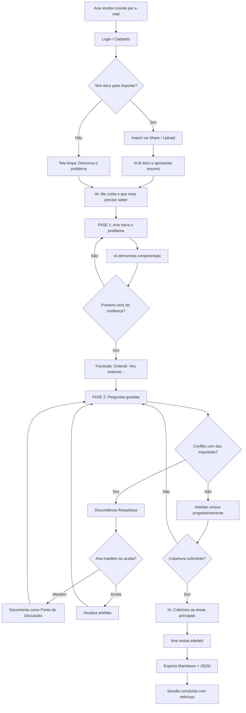
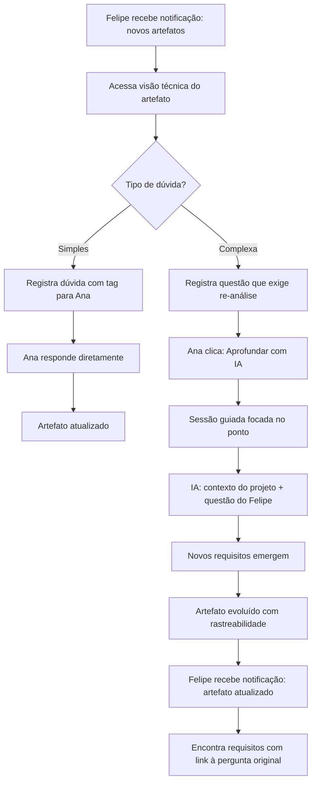
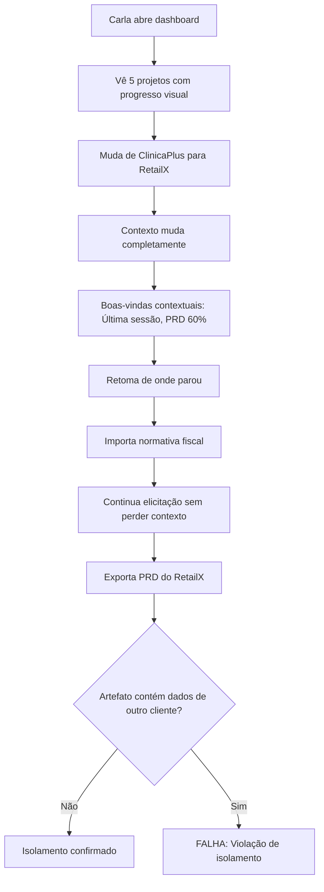

# UX Design Specification ReqStudio

**Author:** Glauber Costa
**Date:** 2026-03-27

---

## Executive Summary

### Visão do Projeto

O ReqStudio é uma plataforma de elicitação de requisitos assistida por IA que traduz conhecimento de domínio em artefatos estruturados. A experiência principal é uma sessão conversacional guiada onde o usuário não-técnico contribui com seu conhecimento e a IA — invisível ao usuário — executa um workflow multi-agente (BMAD) para produzir artefatos profissionais em formato dual (humano + máquina).

O desafio central de UX é criar uma interface de aparência simples (chat) que execute um processo complexo por trás, dando ao usuário sensação de fluidez, progresso e controle.

### Usuários-Alvo

**Primária (MVP): Ana — Especialista de Domínio**
- Não-técnica, gerente de operações, 30 anos
- Tech level: baixo. Nunca escreveu um requisito de software
- Uso: sessão solo de elicitação, exporta artefatos
- Expectativa: sentir-se guiada sem ser infantilizada

**Secundária (MVP): Carla — Consultora Multi-Cliente**
- Técnica em negócios, consultora independente, 42 anos
- Tech level: médio. Gerencia múltiplos projetos/clientes
- Uso: multi-projeto com troca rápida de contexto e isolamento
- Expectativa: organização visual e zero contaminação entre clientes

**Growth: Felipe — Desenvolvedor Stakeholder**
- Técnico, dev fullstack, 28 anos
- Uso: visualiza artefatos técnicos, registra dúvidas/feedback
- Expectativa: acesso rápido a artefatos estruturados, feedback direto

### Modelo de Interação

A sessão de elicitação opera em duas fases com transição fluida:

**Fase 1 — Contextualização (Usuário como Narradora)**
O usuário conta o problema, descreve o cenário, complementa os documentos que importou ao criar o projeto. A IA atua como ouvinte ativa: absorve, sintetiza e faz perguntas de esclarecimento. A input area suporta texto longo, uploads inline e parágrafos.

**Fase 2 — Descoberta Guiada (IA como Facilitadora)**
Após contextualizado, o sistema assume a condução: faz perguntas estruturadas, desafia respostas, sugere cenários não cobertos. Sempre abre espaço explícito para o usuário complementar e levantar novas dúvidas. A transição é sinalizada naturalmente pela IA.

### Desafios de Design

1. **Paradoxo da simplicidade profunda** — Interface chat que esconde workflow multi-etapa complexo. Sensação de fluidez + estrutura rígida por trás.
2. **Preview progressivo do artefato** — Mostrar chat + artefato em construção no mesmo espaço, especialmente em mobile-first (360px).
3. **Importação de documentos mid-session** — Integrar upload sem interromper o fluxo da sessão.
4. **Dual output legível** — Toggle entre visão de negócio e técnica, intuitivo pra não-técnicos.
5. **Mobile-first com sessão longa** — Sessões de 30 min no celular exigem design contra fadiga.
6. **Transição entre fases** — Fase 1 (narrativa livre) → Fase 2 (guiada) sem ruptura perceptível.

### Oportunidades de Design

1. **Dashboard de progresso visual** — Projetos com % completude e próximo passo, não lista de arquivos. A Carla vê seus 5 clientes com status instantâneo.
2. **Indicador de cobertura como barra de progresso** — Gamificação sutil que motiva aprofundamento e mostra seções pendentes.
3. **Micro-celebrações por etapa** — Animações de progresso que reforçam construção progressiva.
4. **Split view adaptativo** — Desktop: chat + artefato lado a lado. Mobile: swipe entre tabs com pulse sutil indicando novidade no artefato.
5. **Input area adaptativa** — Expansível na Fase 1 (narradora), mais compacta na Fase 2 (respostas guiadas), sempre com convite explícito pra expandir.

## Core User Experience

### Experiência Definidora

A experiência central do ReqStudio é o **primeiro ciclo de confiança**: Ana descreve seu problema → IA responde com uma pergunta que demonstra compreensão → Ana pensa "ela entendeu". Se esse ciclo funcionar nos primeiros 2 minutos, Ana confia e segue na sessão. Se falhar, o produto perdeu a usuária.

Toda a UX é otimizada para que esse momento aconteça rápido e com naturalidade:
- Pergunta de abertura simples e acolhedora (não um formulário)
- Resposta da IA que demonstra escuta, não repetição
- Zero terminologia técnica na interação
- A primeira resposta da IA é a interação mais bem polida de todo o produto — investimento desproporcional nela
- Tom de parceira experiente, não de assistente genérico
- Input area da Fase 1 comunica "fale à vontade, estou ouvindo" — ampla, sem pressa

### Estratégia de Plataforma

**Abordagem:** Web app responsiva mobile-first (PWA candidata para Growth).

| Plataforma | Suporte | Notificações |
|-----------|---------|:---:|
| Mobile (360px+) | Funcional completo — design primário | ✅ Push (Growth) |
| Tablet (768px+) | Otimizado — split view | ✅ Push (Growth) |
| Desktop (1024px+) | Otimizado — split view expandido | ✅ Browser notifications |

**Offline:** Sem funcionalidade offline de elicitação (a IA é essencial para a coerência do processo). Em ausência de conexão:
- Modo notepad disponível — Ana anota insights, perguntas e observações
- Ao retomar conexão, notas são apresentadas à IA como contexto adicional
- IA incorpora as anotações na sessão em andamento

**Justificativa:** Tentar replicar o processo de elicitação offline comprometeria a qualidade e poderia criar artefatos inconsistentes. O notepad preserva o valor do pensamento da Ana sem arriscar a integridade do processo.

### Interações que Devem Ser Invisíveis

Ações que acontecem automaticamente, sem decisão do usuário:

1. **Auto-save contínuo** — cada mensagem e cada estado da sessão são salvos automaticamente. Ana nunca precisa "salvar progresso"
2. **Boas-vindas contextuais** — ao entrar em um projeto, o sistema apresenta resumo do que foi trabalhado, onde parou e o que pode esperar da nova sessão
3. **Transição de fase** — a mudança de Contextualização para Descoberta Guiada acontece naturalmente, sem botão ou prompt explícito
4. **Indicador de cobertura** — atualiza-se em tempo real conforme seções são exploradas, sem intervenção
5. **Formatação do artefato** — o conteúdo é automaticamente organizado no formato correto (humano e técnico), sem que Ana precise escolher

### Momentos Críticos de Sucesso

| Momento | Quando | Indicador de Sucesso | Risco se Falhar |
|---------|--------|---------------------|-------------------|
| **Primeiro ciclo de confiança** | Primeiros 2 min da primeira sessão | Ana pensa "ela entendeu" | Abandono imediato |
| **Primeiro artefato visível** | ~10 min de sessão | Ana vê algo tangível se formando | "Isso não leva a nada" |
| **Exportação com orgulho** | Final da sessão | Ana exporta e sente que pode levar pra reunião | "Isso não me serve" |
| **Retomada sem perda** | Reabertura do projeto | Resumo contextual + continuidade sem fricção | "Tenho que começar de novo?" |
| **Troca de projeto (Carla)** | Alternando clientes | Zero contaminação + contexto correto | Perda de confiança profissional |

### Princípios de Experiência

1. **Confiança antes de tudo** — Cada interação deve reforçar que a IA entendeu o domínio da Ana. Nunca responder genérico.
2. **Progresso visível, processo invisível** — O artefato cresce diante dos olhos da Ana, mas o workflow BMAD por trás é completamente imperceptível.
3. **Sem becos sem saída** — A Ana nunca deve ficar "travada" sem saber o que fazer. O sistema sempre sugere o próximo passo.
4. **Respeitar a inteligência** — Ana não é técnica, mas é especialista. A interface guia sem infantilizar — linguagem de negócio, não didática.
5. **Acessível em qualquer tela** — A mesma experiência core funciona no celular na fila do café e no desktop do escritório.

## Resposta Emocional Desejada

### Objetivos Emocionais Primários

- **Segurança** — Ana sente que o ambiente é confiável: dados preservados, processo transparente, nada se perde
- **Competência** — Ana sente que seu conhecimento é valorizado e que ela está construindo algo útil, não preenchendo um formulário
- **Controle** — Ana decide. A IA sugere, desafia e documenta, mas nunca impõe

### Mapa Emocional da Jornada

| Momento | Emoção Desejada | Anti-emoção (evitar) |
|---------|----------------|---------------------|
| Primeiro acesso | Curiosa e segura — "parece simples" | Intimidada, perdida |
| Descrevendo o problema | Ouvida — "alguém presta atenção" | Ignorada, apressada |
| Primeira resposta da IA | Impressionada — "ela entendeu!" | Cética, decepcionada |
| Fase guiada | Conduzida com respeito | Interrogada, infantilizada |
| Artefato crescendo | Orgulho — "eu contribuí pra isso" | "Isso não leva a nada" |
| Exportando | Confiante — "posso levar pra reunião" | "Isso não me serve" |
| Interrupção/erro | Segura — "nada se perdeu, posso continuar" | Ansiosa, frustrada |
| Discordando da IA | No controle — "ela ouviu e respeitou" | Desautorizada, impotente |
| Retomando sessão | Aliviada — "está tudo aqui" | "Tenho que recomeçar" |

### Micro-Emoções Críticas

**Confiança vs. Ceticismo** — A mais crítica. Cada interação da IA deve reforçar que ela entende o domínio. Uma resposta genérica destrói sessões de confiança construída.

**Competência vs. Infantilização** — A IA desafia sem menosprezar. Usa frases como "Pelo contexto/documentos, eu esperaria X — mas você conhece melhor esse mercado" em vez de "Você tem certeza?" ou "Isso está incorreto".

**Controle vs. Imposição** — Quando Ana discorda da IA sobre algo do domínio dela:
1. IA aponta cordialmente as inconsistências que levaram ao raciocínio
2. IA reconhece explicitamente a expertise de domínio da Ana
3. Ana pode manter sua posição, mesmo contraditória
4. Decisão é documentada como "Ponto de Discussão" no artefato — sugestão de tópico a validar com demais participantes do projeto

**Segurança na interrupção** — Se conexão cai ou sessão é interrompida:
1. Auto-save contínuo garante zero perda
2. Ao retornar, sistema mostra exatamente onde parou e qual era a última interação
3. Emoção target: alívio imediato, não ansiedade seguida de alívio

### Implicações de Design

| Emoção | Decisão de UX |
|--------|---------------|
| Segurança | Indicador discreto de "salvo" sempre visível. Mensagem de reconexão contextual |
| Competência | Linguagem de negócio, nunca didática. IA referencia domínio da Ana |
| Controle | Botão "Manter minha posição" quando há discordância. Tag de Discussão no artefato |
| Confiança | Primeira resposta da IA investida desproporcionalmente em demonstrar compreensão |
| Progresso | Preview progressivo do artefato. Indicador de cobertura por seção |
| Alívio | Resumo contextual ao retomar. "Voltamos onde paramos" como frase-chave |

### Princípios de Design Emocional

1. **O usuário é a autoridade do domínio. A IA é a autoridade do processo** — Ana decide sobre regras de negócio; a IA decide sobre a melhor forma de documentá-las
2. **Discordância documentada, nunca bloqueada** — Se Ana insiste numa posição que conflita com documentos/requisitos, o sistema aceita, documenta e marca como ponto de discussão para o time
3. **Zero ansiedade de perda** — O usuário nunca precisa pensar em salvar, em perder progresso ou em recomeçar. Tudo é preservado, sempre
4. **Desafiar com elegância** — A IA desafia mostrando evidências (docs, inconsistências), nunca com autoridade própria. Sempre oferece saída honrosa
5. **Orgulho na saída** — O artefato final deve fazer Ana sentir que *ela* construiu algo profissional, não que "a IA fez pra ela"

## Análise de Padrões UX e Inspiração

### Produtos Inspiradores

**NotebookLM (Google)** — Referência primária
- Modelo mental: Sources → Interaction → Output = paradigma idêntico ao ReqStudio
- Studio Panel como hub de transformação — espelhável no painel de artefato
- Import via Share nativo no mobile (Web Share API) — friction-free
- Citation badges clicáveis que remetem à fonte original — aplicável a FR10
- Progress persistente entre sessões — alinhado com auto-save do ReqStudio
- Workflow unificado: zero tab overwhelm
- ⚠️ **Diferença fundamental:** no NotebookLM sources são passivos (referência). No ReqStudio, sources são **ativos** — a IA desafia a Ana com base neles, referencia trechos, e cita fontes nos artefatos

**ChatGPT (OpenAI)** — Referência de interação conversacional
- Chat fluido com resposta streaming — padrão de feedback em tempo real
- Input expansível que se adapta ao conteúdo
- Anti-pattern: genérico demais, sem estrutura visível de progresso

**Notion AI** — Referência de construção inline
- IA gera conteúdo dentro do documento, não em janela separada
- Modelo "documento vivo" — o output é editável e visível durante a interação

**Typeform** — Referência de fluxo guiado (com ressalva)
- Uma pergunta por vez, transições suaves, formato que não parece formulário
- Relevante para Fase 2 guiada
- ⚠️ **Ressalva:** não limitar o espaço de resposta — Ana pode ter MUITO a dizer por pergunta. Input sempre expansível, mesmo na Fase 2

**Linear** — Referência de dashboard multi-projeto
- Interface limpa, status visual imediato, troca de contexto rápida
- Aplicável ao dashboard da Carla — 5 projetos com % de progresso

**Grammarly** — Referência de desafio não-impositivo
- Sugestões inline que o usuário aceita ou ignora — nunca bloqueia
- Modelo de "discordância elegante" para quando a IA desafia Ana

### Padrões Transferíveis

**Navegação:**
- Modelo NotebookLM: Sources → Interaction → Output como estrutura primária
- Dashboard estilo Linear para multi-projeto com progresso visual

**Interação:**
- Input expansível (ChatGPT) para Fase 1 narradora — sempre amplo
- Pergunta focada (Typeform) para Fase 2, mas sem limitar input
- Streaming de resposta (ChatGPT) para feedback em tempo real
- Import via Web Share API (NotebookLM) para documentos no mobile

**Output — Renderização Adaptativa:**
- **Desktop:** Split view — chat + artefato como documento completo lado a lado
- **Mobile:** Tabbed view com badge de novidade no tab do artefato (não split)
- **Mobile artefato:** Card view por seção (Artifact as Feed) — cada seção é um card swipeable com indicador de cobertura, mais nativo de mobile que documento longo
- Citation badges (NotebookLM) para rastreabilidade de fontes em ambos

**Desafio e Feedback:**
- Sugestão não-impositiva (Grammarly) para discordância respeitosa
- Sources ativos — IA referencia trechos dos docs importados como evidência

### Anti-Padrões a Evitar

| Anti-padrão | Por que evitar | Fonte |
|------------|---------------|-------|
| Chat genérico sem estrutura | Ana não percebe progresso nem valor | ChatGPT-like |
| Upload menu complexo | Fricção em mobile — Web Share API é melhor | Apps tradicionais |
| Split view forçado em mobile | Documento longo em split é ilegível em 360px | Desktop-first apps |
| "Desktop no celular" | Documento Markdown longo no mobile é péssimo — usar card view | Responsive naïve |
| Modal de erro intrusivo | Gera ansiedade. Preferir inline + recuperação automática | UIs legadas |
| Formulários longos de setup | Ana desiste antes de começar | SaaS tradicionais |
| Input limitado na Fase 2 | Ana pode ter muito a dizer por pergunta — nunca restringir | Typeform literal |
| IA que "sabe mais que o usuário" | Destrói confiança de domínio | Chatbots assertivos |

### Estratégia de Inspiração

**Adotar:**
- Sources → Interaction → Output (NotebookLM) como modelo mental
- Web Share API para import mobile
- Citation badges para rastreabilidade
- Tabbed view + badge de novidade no mobile

**Adaptar:**
- Studio Panel → Card view por seção no mobile (Artifact as Feed)
- Chat fluido (ChatGPT) + estrutura guiada (Typeform) = sessão em duas fases
- Dashboard (Linear) simplificado para não-técnicos
- Sugestão inline (Grammarly) adaptada para discordância de domínio
- Sources passivos (NotebookLM) → Sources ativos (IA desafia com base neles)

**Evitar:**
- Genericismo de chat sem progresso visível
- Split view em mobile
- IA impositiva que desautoriza o especialista
- Tratamento idêntico mobile/desktop para documentos longos

## Design System Foundation

### Escolha do Design System

**shadcn/ui + Tailwind CSS + Radix UI primitives**

Componentes copy-paste com controle total de código, estilização via Tailwind CSS e acessibilidade via Radix UI primitives. Sem lock-in de dependência — os componentes pertencem ao projeto.

### Rationale da Seleção

| Critério | shadcn/ui atende |
|----------|------------------|
| Dev solo MVP | ✅ Copy-paste, sem setup complexo |
| Mobile-first (NFR16) | ✅ Tailwind responsive utilities (sm/md/lg) |
| Acessibilidade (NFR17, NFR18) | ✅ Radix primitives com ARIA e keyboard nav built-in |
| Customização de marca | ✅ Design tokens via CSS variables — controle total |
| Interface de chat | ✅ ScrollArea, Card, Input, Sheet adaptáveis a chat |
| Renderização adaptativa | ✅ Tabs para mobile, ResizablePanel para desktop split |
| Performance (NFR2) | ✅ Sem runtime overhead — CSS puro compilado |

### Abordagem de Implementação

**Setup base:**
- Next.js (ou framework SPA) + Tailwind CSS + shadcn/ui init
- Configuração de design tokens via `globals.css` (CSS variables)
- Tema dark/light com toggle (segurança emocional = user no controle)

**Componentes shadcn/ui a utilizar:**
- `ScrollArea` — chat com scroll suave
- `Card` — cards de seção no Artifact as Feed (mobile)
- `Tabs` — tabbed view mobile (chat/artefato)
- `ResizablePanel` — split view desktop (chat + artefato)
- `Sheet` — painel lateral para docs de referência e settings
- `Dialog` — confirmações e discordância respeitosa
- `Badge` — indicadores de novidade e cobertura
- `Progress` — indicador de cobertura por seção
- `Textarea` — input expansível para Fase 1 narradora
- `Button` — ações primárias e "Manter minha posição"
- `Avatar` — identidade visual da IA na conversa
- `Tooltip` — micro-ajudas contextuais

**Componentes custom necessários (não existem no shadcn):**
- `ChatMessage` — mensagem de chat com suporte a streaming e citation badges
- `ArtifactCard` — card de seção do artefato com indicador de cobertura
- `ProjectDashboard` — grid de projetos com progresso visual estilo Linear
- `SaveIndicator` — indicador discreto de "salvo" que reforça zero ansiedade
- `DisagreementPanel` — painel para "Manter minha posição" com documentação

### Estratégia de Customização

**Design Tokens (CSS Variables):**
- Cores: paleta a definir no step de visual design — foco em confiança e calma
- Tipografia: font stack profissional mas acessível (ex: Inter)
- Espaçamento: generoso — "respire fundo", especialmente em mobile
- Raio de borda: suave, não agressivo (8px+)
- Sombras: sutis, não flat nem brutalist

**Tema:**
- Light mode como padrão (acessibilidade + Ana não é dev)
- Dark mode disponível como opção
- Contrast mode para WCAG AAA (future)

## Core User Experience — Experiência Definidora

### Defining Experience

**"Conversa com IA, sai PRD"** — O usuário conta o problema pro sistema e ele monta o documento de requisitos conversando com o usuário.

Metáfora: **entrevista com consultor muito bom** — Ana conversa, o consultor faz anotações estruturadas e entrega um relatório profissional.

### Modelo Mental do Usuário

| O que Ana pensa | O que acontece por trás |
|----------------|------------------------|
| "Vou contar meu problema" | Fase 1 — Input narrativo, IA como ouvinte |
| "Ela está me fazendo boas perguntas" | Fase 2 — BMAD workflow multi-etapa |
| "O documento está ficando bom" | Artefato sendo montado progressivamente |
| "Pronto, posso exportar" | Output dual (humano + técnico) |

O BMAD, os workflows e os agentes são completamente invisíveis. Ana nunca sabe que existem.

### Mecânica da Experiência

**1. Iniciação:**
- Projeto existente: boas-vindas contextuais (onde parou, o que esperar)
- Projeto novo sem docs: *"Descreva o problema que você quer resolver"* — campo amplo
- Projeto novo com docs: *"Li os documentos que você trouxe. Entendi que se trata de [resumo]. Me conta o que mais preciso saber."*

**2. Interação (Fase 1 → Fase 2):**
- Ana narra → IA demonstra compreensão (primeiro ciclo de confiança)
- IA faz perguntas de esclarecimento → Ana complementa
- Transição natural: *"Entendi o cenário. Agora vou explorar alguns pontos..."*
- Fase 2: perguntas estruturadas, desafios baseados em docs, sugestões de cenários

**3. Feedback:**
- Artefato cresce no painel lateral (desktop) ou tab com badge (mobile)
- Indicador de cobertura atualiza em tempo real
- Citation badges quando IA referencia docs importados
- Auto-save com indicador discreto

**4. Conclusão:**
- IA sinaliza: *"Cobrimos as áreas principais. Quer aprofundar algum ponto?"*
- Ana revisa artefato (document view ou card feed)
- Exporta em Markdown/JSON
- Sistema marca sessão como concluída com métricas de cobertura

### Análise de Padrões: Familiar + Inovação

| Aspecto | Padrão | Tipo |
|---------|--------|------|
| Input conversacional | Chat (familiar) | Estabelecido |
| Artefato em construção | Studio Panel (NotebookLM) | Adaptado |
| Sources ativos | IA desafia com base em docs | **Inovação** |
| Duas fases de interação | Narradora → Guiada | **Inovação** |
| Discordância documentada | "Manter posição" + tag | **Inovação** |
| Card feed mobile | Artefato como seções swipeable | **Inovação** |

## Visual Design Foundation

### Sistema de Cores

**Filosofia:** Confiança profissional + calor humano. Nem "app de banco" (frio) nem "app de wellness" (pastel demais). O ReqStudio transmite: "sou uma ferramenta séria que trata você como gente".

**Paleta Primária:**

| Papel | Cor | HSL | Uso |
|-------|-----|-----|-----|
| **Primary** | Indigo profundo | `hsl(234, 89%, 56%)` | Botões primários, links, ação principal |
| **Primary Hover** | Indigo escuro | `hsl(234, 89%, 48%)` | Hover states |
| **Primary Light** | Indigo suave | `hsl(234, 89%, 96%)` | Backgrounds sutis, seleção |
| **User Message** | Indigo médio | `hsl(234, 70%, 65%)` | Mensagens do usuário no chat (não clicável) |

⚠️ **Regra de hierarquia cromática:** Indigo forte (`primary`) = elementos interativos (botões, links). Indigo médio (`user-message`) = conteúdo do usuário (mensagens de chat). Nunca usar a mesma cor para ações clicáveis e conteúdo passivo.

**Rationale:** Indigo combina a confiança do azul com a criatividade do roxo. É profissional para Felipe (dev) sem ser frio para Ana. O NotebookLM usa tons similares — validação de que funciona para "tools de IA".

**Paleta de Acentos:**

| Papel | Cor | HSL | Uso |
|-------|-----|-----|-----|
| **Accent** | Âmbar quente | `hsl(38, 92%, 50%)` | Progresso, badges, celebrações |
| **Accent Light** | Âmbar suave | `hsl(38, 92%, 95%)` | Highlight de novidade |

**Rationale:** Âmbar é a cor do "progresso visível" — barra de cobertura, badge de novidade no artefato, micro-celebrações. Contrasta bem com indigo.

**Paleta Semântica:**

| Papel | Cor | HSL | Uso |
|-------|-----|-----|-----|
| **Success** | Esmeralda | `hsl(152, 69%, 41%)` | Cobertura completa, confirmações |
| **Warning** | Âmbar escuro | `hsl(38, 92%, 45%)` | Pontos de Discussão, atenção |
| **Error** | Coral suave | `hsl(0, 72%, 58%)` | Erros, estados críticos |
| **Info** | Indigo claro | `hsl(234, 60%, 65%)` | Citation badges, tooltips |

**Paleta de Neutros (warm grays):**

| Papel | Cor | HSL | Uso |
|-------|-----|-----|-----|
| **Background** | Cinza aquecido | `hsl(220, 14%, 98%)` | Background principal (light) |
| **Surface** | Branco | `hsl(0, 0%, 100%)` | Cards, painéis |
| **Border** | Cinza sutil | `hsl(220, 13%, 91%)` | Bordas, divisores |
| **Text Primary** | Grafite | `hsl(224, 71%, 13%)` | Texto principal |
| **Text Secondary** | Cinza médio | `hsl(220, 9%, 46%)` | Labels, texto auxiliar |
| **Text Muted** | Cinza claro | `hsl(220, 9%, 63%)` | Placeholder, timestamps |

**Rationale:** Warm grays (com leve tint azulado) evitam a frieza clínica de gray puro. Ana sente acolhimento, Felipe sente profissionalismo.

**Dark Mode:**
- Background: `hsl(224, 30%, 10%)` — não preto puro (menos agressivo)
- Surface: `hsl(224, 25%, 14%)` — elevação sutil
- Cores primárias e de acento mantêm saturação, ajustam luminosidade

### Sistema Tipográfico

**Font Stack:**

| Uso | Font | Fallback | Rationale |
|-----|------|----------|----------|
| **UI/Corpo** | Inter | system-ui, sans-serif | Legibilidade excelente de 12px a 48px. Profissional e acessível |
| **Técnico** | JetBrains Mono | monospace | Para visão técnica do artefato (Felipe). Legível, moderna |

**Type Scale (base 16px):**

| Token | Size | Weight | Line Height | Uso |
|-------|------|--------|-------------|-----|
| `display` | 30px | 700 | 1.2 | Título da página, nome do projeto |
| `h1` | 24px | 600 | 1.3 | Títulos de seção |
| `h2` | 20px | 600 | 1.35 | Subtítulos |
| `h3` | 16px | 600 | 1.4 | Labels de grupo |
| `body` | 15px | 400 | 1.6 | Texto corrido, chat messages |
| `body-sm` | 13px | 400 | 1.5 | Texto auxiliar, timestamps |
| `caption` | 12px | 500 | 1.4 | Badges, indicadores |
| `mono` | 14px | 400 | 1.5 | Código, visão técnica (JetBrains Mono) |

**Rationale:** Body a 15px (não 14) com line-height 1.6 — otimizado para leitura de chat em mobile. Sessões de 30 min exigem conforto visual.

### Espaçamento e Layout

**Base Unit:** 4px — todo espaçamento é múltiplo de 4.

| Token | Valor | Uso |
|-------|-------|-----|
| `space-1` | 4px | Micro gaps (badge padding) |
| `space-2` | 8px | Gaps entre elementos pequenos |
| `space-3` | 12px | Padding de input, gap entre mensagens |
| `space-4` | 16px | Padding de cards, margin entre seções |
| `space-5` | 24px | Separação entre blocos |
| `space-6` | 32px | Margin de seção |
| `space-8` | 48px | Separação de áreas principais |

**Espaçamento generoso em mobile:** padding horizontal mínimo de 16px. Mensagens de chat com 12px de gap. "Respire fundo" como princípio.

**Border Radius:**

| Token | Valor | Uso |
|-------|-------|-----|
| `radius-sm` | 6px | Badges, inputs |
| `radius-md` | 8px | Cards, botões |
| `radius-lg` | 12px | Modais, painéis |
| `radius-full` | 9999px | Avatares, pills |

**Sombras:**

| Token | Valor | Uso |
|-------|-------|-----|
| `shadow-sm` | `0 1px 2px rgba(0,0,0,0.05)` | Cards em repouso |
| `shadow-md` | `0 4px 6px rgba(0,0,0,0.07)` | Cards em hover, dropdowns |
| `shadow-lg` | `0 10px 15px rgba(0,0,0,0.1)` | Modais, sheets |

### Considerações de Acessibilidade

- Contraste mínimo 4.5:1 para texto (WCAG 2.1 AA — NFR17)
- Contraste mínimo 3:1 para elementos interativos
- Focus ring visível em todos os componentes interativos (NFR18)
- Cores nunca são o único diferenciador — sempre acompanhadas de ícone/texto
- Touch targets mínimos de 44x44px em mobile
- Paleta testada com simulação de daltonismo (protanopia, deuteranopia)

## Design Direction Decision

### Direções Exploradas

Foi gerado um showcase HTML interativo (`ux-design-directions.html`) com mockups de 3 telas críticas em versões mobile (375px) e desktop (1280px):

1. **Sessão de Elicitação** — A tela core. Mobile com tabbed view (chat/artefato + badge de novidade). Desktop com split view (chat + artefato progressivo lado a lado). Barra de cobertura âmbar, citation badges indigo, auto-save indicator.

2. **Dashboard de Projetos** — Hub multi-projeto estilo Linear. Cards com barra de progresso colorida por fase, status visual, troca de contexto instantânea.

3. **Padrões UX Especiais** — Discordância Respeitosa (painel com evidencia + botões "Manter/Aceitar"), Boas-vindas Contextuais ("Bem-vinda de volta, Ana!" com resumo de progresso), Artifact as Feed (cards por seção com cobertura swipeable).

### Direção Escolhida

**Direção única — todos os mockups representam a mesma visão coesa.**

A exploração confirmou que a paleta indigo + âmbar, tipografia Inter, e os padrões definidos nos steps anteriores funcionam bem juntos. Não foram necessárias variações de direção — a fundação visual é coerente.

### Rationale

- Paleta indigo/âmbar comunica confiança + progresso
- Tabbed view mobile elimina split view inviável em 375px
- Card feed no artefato mobile é mais nativo que documento longo
- Discordância Respeitosa valida o princípio emocional "autoridade do domínio"
- Boas-vindas contextuais validam "zero ansiedade de perda"

### Correções Pós-Revisão (War Room)

| Achado | Correção aplicada |
|--------|------------------|
| Mensagem do usuário e botão com mesma cor | Token `user-message` adicionado — indigo médio `hsl(234, 70%, 65%)` para mensagens, indigo forte para botões |
| ResizablePanel + streaming = flicker | MVP: proporção fixa (40/60). V2: ResizablePanel |
| Swipe horizontal não escala | Scroll vertical de cards no mobile (não swipe horizontal) |
| Web Share API sem suporte desktop | Fallback: upload tradicional no desktop |
| Badge de novidade requer backend complexo | MVP: badge simples "Atualizado" sem granularidade por seção |

## User Journey Flows

### Jornada 1 — Ana: Primeira Sessão de Elicitação

### Jornada 2 — Felipe + Ana: Re-análise Colaborativa

### Jornada 3 — Carla: Multi-Projeto com Isolamento

### Padrões de Jornada Extraídos

**Navegação:**
- Entry point sempre leve (convite por e-mail, dashboard limpo)
- Transição Fase 1 → Fase 2 natural, sem quebra

**Feedback:**
- Barra de cobertura como indicador contínuo de progresso
- Notificações para colaboradores quando artefato muda
- Badge de novidade no tab do artefato (mobile)

**Recuperação:**
- Auto-save elimina ansiedade
- Boas-vindas contextuais permitem retomar sem re-leitura
- Discordância Respeitosa nunca bloqueia — documenta e segue

### Princípios de Otimização

1. **Mínimo de steps para valor** — Ana chega ao primeiro artefato em < 30 min
2. **Carga cognitiva zero** — Uma pergunta por vez na Fase 2, contexto sempre visível
3. **Feedback contínuo** — Artefato cresce em tempo real, barra de cobertura anima
4. **Erro como oportunidade** — Discordância vira Ponto de Discussão (valor, não falha)
5. **Colaboração assíncrona** — Felipe não espera Ana; notificação e rastreabilidade

## Estratégia de Componentes

### Componentes do Design System (shadcn/ui)

Componentes disponíveis que cobrem necessidades do ReqStudio:

| Componente shadcn | Uso no ReqStudio | Customização |
|-------------------|-----------------|-------------|
| `ScrollArea` | Chat scroll | Nenhuma |
| `Tabs` | Chat/Artefato mobile | Badge customizado |
| `ResizablePanel` | Split view desktop | Proporções ajustáveis |
| `Card` | Project cards, artifact cards | Estilização custom |
| `Badge` | Cobertura, novidade, citation | Variantes custom |
| `Progress` | Barra de cobertura | Cor por estado |
| `Textarea` | Input expansível | Auto-resize |
| `Button` | Ações primárias/secundárias | Hierarquia visual |
| `Dialog` | Confirmações, export | Padrão |
| `Sheet` | Painel lateral de docs | Padrão |
| `Avatar` | Identidade da IA | Custom |
| `Tooltip` | Micro-ajudas | Padrão |
| `DropdownMenu` | Ações de projeto | Padrão |
| `Skeleton` | Loading states | Padrão |

### Componentes Custom

#### `ChatMessage`
- **Propósito:** Mensagem individual no chat de elicitação
- **Variantes:** `ai` (com avatar, nome, citation badges), `user` (alinhado à direita, cor user-message)
- **Estados:** default, streaming (animação de digitação), erro
- **Features:** Suporte a citations clicáveis, markdown rendering, código inline
- **Mobile:** Max-width 85%, fonte 14px, espaçamento 12px entre msgs

#### `ArtifactCard`
- **Propósito:** Card de seção do artefato no feed mobile
- **Variantes:** `complete` (borda verde), `active` (borda âmbar, badge "Ao vivo"), `pending` (opacidade reduzida)
- **Features:** Coverage badge, contagem de fontes, timestamp
- **Interação:** Tap para expandir conteúdo, scroll vertical para navegar

#### `DisagreementPanel`
- **Propósito:** Painel de discordância respeitosa quando IA desafia Ana
- **Anatomia:** Header (icon + "Decisão de Domínio"), Body (explicação), Referência (citação do doc), Ações (Manter / Aceitar)
- **Nota:** Se mantiver, texto informa que será documentado como Ponto de Discussão
- **Acessibilidade:** ARIA role="alert", foco automático no painel

#### `WelcomeScreen`
- **Propósito:** Boas-vindas contextuais ao retomar projeto
- **Anatomia:** Greeting, nome do projeto, resumo de progresso (checklist), próximo passo sugerido, botão "Continuar sessão"
- **Features:** Dinamic — conteúdo gerado a partir do estado do projeto

#### `SaveIndicator`
- **Propósito:** Indicador discreto de save automático
- **Anatomia:** Dot verde + texto "Salvo há Xs"
- **Comportamento:** Aparece por 3s após save, depois fica sutil

#### `CoverageBar`
- **Propósito:** Barra de cobertura global do artefato
- **Anatomia:** Label ("Cobertura 65%"), track, fill colorido
- **Cores:** < 30% = muted, 30-70% = âmbar, > 70% = success

#### `CitationBadge`
- **Propósito:** Badge clicável que referencia documento importado
- **Anatomia:** Ícone clip + nome do doc (ou página específica)
- **Interação:** Clique abre preview do trecho referenciado
- **Cor:** Info (indigo claro)

### Roadmap de Implementação

**Fase 1 — Core (MVP):**
- `ChatMessage` + `CoverageBar` + `SaveIndicator` (necessários para a sessão core)
- Layout split (desktop) + tabs (mobile)

**Fase 2 — Colaboração:**
- `DisagreementPanel` + `CitationBadge` (necessários para sources ativos)
- `ArtifactCard` (artifact as feed mobile)
- `WelcomeScreen` (retomada de sessão)

**Fase 3 — Multi-projeto:**
- Dashboard com project cards
- Notificações cross-projeto

## UX Consistency Patterns

### Hierarquia de Botões

| Nível | Componente | Uso | Exemplo |
|-------|-----------|-----|--------|
| **Primário** | Button solid (indigo) | Ação principal da tela | "Enviar", "Continuar sessão", "Exportar" |
| **Secundário** | Button outline | Ação alternativa | "Manter minha posição", "Ver artefato" |
| **Terciário** | Button ghost / link | Ação sutil | "Cancelar", "Voltar", timestamps clicáveis |
| **Destrutivo** | Button solid (coral) | Ações irreversíveis | "Excluir projeto" (com confirmação) |

**Regra:** Máximo 1 botão primário por área visível. Sempre à direita ou abaixo.

### Padrões de Feedback

| Tipo | Visual | Duração | Exemplo |
|------|--------|---------|--------|
| **Sucesso** | Toast verde discreto | 3s auto-dismiss | "Artefato exportado" |
| **Informação** | Inline indigo claro | Persistente | Citation badge, tooltip |
| **Aviso** | Inline âmbar (Ponto de Discussão) | Persistente até ação | DisagreementPanel |
| **Erro** | Inline coral com ícone | Persistente até resolvido | "Falha ao salvar. Tentando novamente..." |
| **Progresso** | CoverageBar + streaming | Contínuo | Barra de cobertura, typing indicator |

**Regra anti-modal:** Erros e avisos NUNCA usam modais. Sempre inline com recuperação automática.

### Padrões de Navegação

**Mobile:**
- Tab bar no topo: Conversa | Artefato (com badge de novidade)
- Header fixo: logo + save indicator
- CoverageBar fixa abaixo do header

**Desktop:**
- Split view: chat (esquerda) | artefato (direita)
- Header fixo: logo + projeto + save indicator
- ResizablePanel para ajuste de proporções

**Dashboard:**
- Grid de project cards (desktop)
- Lista de project cards (mobile)
- Botão "+ Novo Projeto" sempre visível

### Estados Vazios e Loading

| Estado | Tratamento |
|--------|------------|
| **Projeto novo** | Ilustração acolhedora + "Descreva o problema que você quer resolver" |
| **Sem projetos** | Ilustração + "Crie seu primeiro projeto" com CTA destacado |
| **Loading de IA** | Typing indicator animado (3 dots) + "Refletindo..." |
| **Loading de página** | Skeleton com animação pulse no layout real |
| **Artefato vazio** | Cards com estado "pendente" (opacidade reduzida) |

### Padrões de Formulário

- **Input único:** Textarea expansível — nunca formulário multi-field
- **Validação:** Inline, em tempo real, sugestões (não bloqueios)
- **Submissão:** Enter para enviar (desktop), botão explícito (mobile)
- **Placeholder:** Contextual ao estado da conversa (nunca genérico)

## Responsive Design & Accessibility

### Estratégia Responsiva

**Mobile-first (320px → 1280px+)**

O ReqStudio é projetado mobile-first. Telas partem do menor viewport e expandem para o desktop.

**Mobile (320px — 767px):**
- Layout single-column
- Tabbed view: Chat | Artefato (com badge de novidade)
- Artifact as Feed: cards por seção com scroll vertical
- Input na base da tela, botão de envio explícito
- Touch targets mínimos 44x44px
- Header compacto: logo + save indicator

**Tablet (768px — 1023px):**
- Layout misto: opcionalmente split view suave
- Artefato expandido com scroll independente
- Gestos de swipe para navegar entre seções
- Dashboard: grid 2 colunas

**Desktop (1024px+):**
- Split view: chat (esquerda, 40%) + artefato (direita, 60%) — proporção fixa no MVP, ResizablePanel na V2
- Dashboard: grid 3-4 colunas
- Atalhos de teclado para ações frequentes

### Breakpoints

| Breakpoint | Tailwind | Mudança principal |
|------------|----------|-------------------|
| 320px | (base) | Mobile base |
| 375px | (base) | Mobile primário |
| 640px | `sm:` | Ajustes de espaçamento |
| 768px | `md:` | Tablet — split view opcional |
| 1024px | `lg:` | Desktop — split view ativo |
| 1280px | `xl:` | Desktop expandido |

### Estratégia de Acessibilidade

**Target: WCAG 2.1 AA** (NFR17)

**Perceptível:**
- Contraste 4.5:1 para texto, 3:1 para UI interativa
- Texto escalável até 200% sem quebra de layout
- Cores nunca são o único indicador — sempre ícone + texto
- Imagens e ícones com alt text descritivo

**Operável:**
- Navegação completa por teclado (Tab, Enter, Escape)
- Focus ring visível com anel de 2px indigo
- Skip links para pular para conteúdo principal
- Touch targets mínimos 44x44px (NFR18)
- Sem time limits em interações do usuário

**Compreensível:**
- Linguagem clara e não-técnica na interface
- Labels explícitos em todos os inputs
- Mensagens de erro descritivas com sugestão de ação
- Previsão de comportamento: botões descrevem o que fazem

**Robusto:**
- HTML semântico (nav, main, article, section)
- ARIA labels em componentes customizados
- Compatível com screen readers (VoiceOver, NVDA)
- Testes automatizados de acessibilidade no CI/CD

### Estratégia de Testes

**Responsivo:**
- Testes em dispositivos reais: iPhone SE, iPhone 14, iPad, desktop 1080p/1440p
- Browser testing: Chrome, Firefox, Safari, Edge
- Testes de performance em 3G simulado

**Acessibilidade:**
- axe-core integrado ao CI/CD
- Testes manuais com VoiceOver (macOS/iOS) e NVDA (Windows)
- Navegação keyboard-only como teste de regressão
- Simulação de daltonismo (Chrome DevTools)

### Diretrizes de Implementação

- Usar unidades relativas (rem, %) — nunca px para font-size
- Media queries mobile-first (`min-width`)
- Tailwind responsive: `sm:`, `md:`, `lg:`, `xl:`
- Foco em performance: lazy loading de imagens, code splitting
- Service Worker para cache de assets (PWA-ready)
- Testar com `prefers-reduced-motion` para usuários sensíveis a animação
